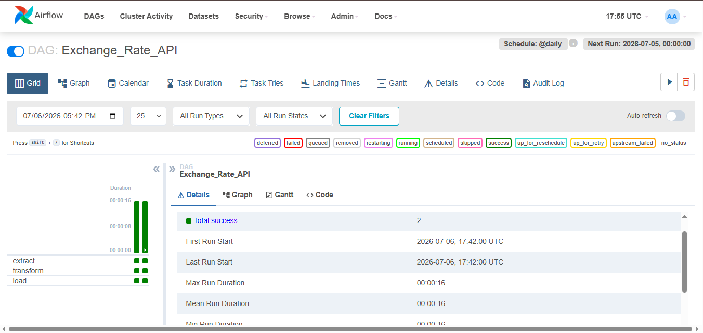

## PKR Exchange Rate ETL Pipeline (Airflow)

Automated ETL pipeline that fetches live PKR exchange rates daily using Apache Airflow and Docker.

## Pipeline Architecture
```
ExchangeRate API (JSON) → Extract → Transform → Load → PostgreSQL
API → S3 (raw) → Transform → S3 (processed) → PostgreSQL
```

## Tech Stack
Python | Apache Airflow | Docker | PostgreSQL | Pandas | SQLAlchemy | AWS S3 (LocalStack) | boto3

## DAG Structure
3 isolated tasks running daily:
- **Extract** — Fetches live rates from ExchangeRate-API for 8 target currencies
- **Transform** — Calculates PKR equivalent rates, adds timestamp
- **Load** — Appends to PostgreSQL (history preserved)

## Currencies Tracked
PKR, USD, EUR, GBP, AED, SAR, CNY, INR, JPY

## Setup

1. Clone the repo
2. Create `.env` file:
```
EXCHANGE_API_KEY=your_key
DB_PASSWORD=your_password
```
3. Run:
```bash
docker-compose up -d
```
4. Open `localhost:8080` — login with your credentials
5. Enable `Exchange_Rate_API` DAG

## Project Structure
```
├── dags/
│   └── Exchange_rate_dag.py          # Airflow DAG
├── docker-compose.yaml
├── .gitignore
└── README.md
```

## Key Concepts Practiced
- Airflow DAGs, Tasks, PythonOperator
- Docker Compose for Airflow + PostgreSQL setup
- Securing credentials via .env + docker env_file
- Inter-task data passing via intermediate CSV files
- Append mode loading for historical data preservation

## Airflow UI


